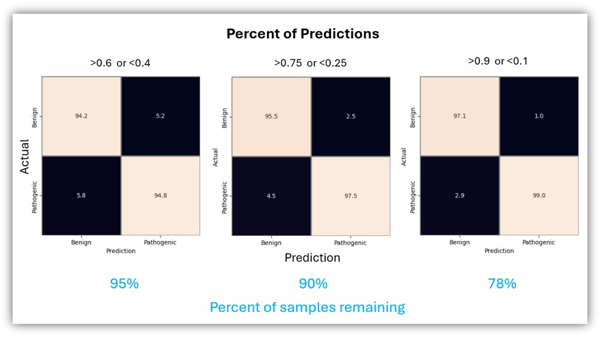

# ML Project: Predicting Variant Pathogenicity
<i>Using only basic info, the model predicts if a SNP is pathogenic or benign with high confidence </i>

## Highlights:
- A histogram-based gradient boosting classification tree that predicts variant effects
- Accuracy ~93%
- Type I error rate: 2.5% 
- Type II error rate: 4.5%
- Effective on 90% of variants

## Input/Output:
- Example input: chr1, position 331523, A>G
- For a known variant: an established phenotype is identified and reported  
- For an unknown variant: model predicts either "likely benign" or "likely pathogenic"

## Rationale
Not all genetic variants are understood. This leaves a gap in our knowledgebase that could be filled via predictive modelling. This ML model is intended to fill that gap by making highly accurate predictions about previously uncharacterized mutations.

<b>For Biologists: </b> Inferred effects can be helpful for research, especially when accompanied by supporting data.

<b>For the Public:</b> Many of us are interested in understanding our own genetics, often paying to have our own genomes commercially sequenced. However understanding the results of whole-genome sequencing can be a challenge due to the potential for unique variants to arise. Companies like 23AndMe provide information about known variants. However, rare or unique variants may have little to no data to support an interpretation, leaving patients in the dark. 

## Prediction overview
A user first enters any mutation (chrom, pos, ref, alt) into the model using a GUI or Python script. The script looks up the variant in the existing database (pre-compiled) to see if clinical information has already been established for that mutation. If so, the effect is reported. If not, the Python script looks uses the entry to look up/calculate the additional features needed as input for the model. The model then predicts the clinical effect of the variant(s). Note: the ML portion of this pipeline is complete, and intended to be a proof-of-concept. Additional features are planned for the future. 

## Training library creation
I wanted the training data to be as comprehensive as possible without limiting the user. Essentially, I wanted basic variant information (chromosome/position/ref/alt allele) to be sufficient to use the model.  

I instantiated my training datbase using the full ClinVar [dataset]([https://ftp.ncbi.nlm.nih.gov/pub/clinvar/vcf_GRCh38/clinvar.vcf.gz.tbi), available on NCBI's website and split multiallelic entries into separate lines using bcftools. To ensure proper variant coordinate calling, I "left-aligned" the dataset. This shifts the start position of a variant to their left-most location, potentially normalizing/fixing issues wiht indel coordinate calling and allowing for consistent variant identification across databases. From this starting point, I added annotations from other databases. 

I then downloaded the [Gnomad](https://gnomad.broadinstitute.org/) genome and exome databases which are quite large. Gnomad exome has data from far more individuals (730,000), but fewer variants (~180 million) because the data are limited to exons. Gnomad genome, has only 1/10th the number of genoems (76,000) but far more variants overall (~760,000,000) due to the significanly higher number of nucleotides per individual. As the genomic data include variants in intronic and other non-coding sequences, the two databases have both disparate and overlapping data. To mine these datasets, I used the bcftools <i>annotate</i> function which matches variants in the Gnomad data to my own using the chromosome name, position, reference allele, and alternative allele. These annotations provided variant allele count, frequency, and the total allele count (size of the full per-allele dataset). I also collected the <b>"nhomalt"</b> metric which is the number of homozygous-alternative individuals, an extremely informative metric. To prevent duplicating or misannotating records, I left-aligned and normalized the combined dataset which identifies and removes duplicates. 

I also anticipated that <b>gene-level</b> data would also be helpful for predicting clinical outcomes by providing information about the general tolerance of whole regions to genetic alteration. Accordingly, I downloaded [gene-level](https://gnomad-public.us-east-1/release/4.1/constraint/gnomad.v4.1.constraint_metrics.tsv) data from Gnomad including constraint scores such as <b>LOEUF, pLI, missense intolerance, and synonymous mutation tolerance</b>. I added them to the training data by converting the gtf-formatted data to a .bed file, and and annotating using bcftools' <i>annotate</i> function. 

Next I added data from <b>dbNSFP</b> - an excellent [database](https://genomemedicine.biomedcentral.com/articles/10.1186/s13073-020-00803-9) with pre-compiled information from a variety of sources including <b>CADD, REVEL, SpliceAI, MPC</b>. Lacking an academic email address, I was forced to download an older copy of the database which lacks <b>SpliceAI</b> data. This necessitated additional, separate downloads and matching of the SpliceAI's SNV data from [Ensemble]( https://ftp.ensembl.org/pub/data_files/homo_sapiens/GRCh38/variation_plugins/spliceai_scores.masked.snv.ensembl_mane.grch38.110.vcf.gz) and [indel data](https://molgenis26.gcc.rug.nl/downloads/vip/resources/GRCh38/spliceai_scores.masked.indel.hg38.vcf.gz) from a community server. I also downloaded <b>regional intolerance data</b> (CCR) including both [autosomes](https://ccrs.s3.us-east-2.amazonaws.com/ccrs/ccrs.autosomes.v2.20180420.bed.gz) and the [X](https://ccrs.s3.us-east-2.amazonaws.com/ccrs/ccrs.xchrom.v2.20180420.bed.gz) chromosome (though no Y-chromosome data). These datasets provided quantitative measurements about variants within coding intervals that are unusually depleted of any non-synonymous changes in large human cohorts. Last I incorporated [transcript-level variant effect predictions](https://ftp.ensembl.org/pub/current_gff3/homo_sapiens/Homo_sapiens.GRCh38.115.chr.gff3.gz)] from <b>Ensemble</b>. At this point, the data were ready for cleanup. 

## Data cleanup and imputation
After exporting my final annotated .vcf file to .tsv (.gz!), there were a number of issues with data formatting. Specifically, disparate data fields form SpliceAI were combined into a single pipe-delimted string. Similarly, mutation type and conservation were all packed into a single entry like: "missense|OR4F5|ENST00000641515|protein_coding|+|36E>36G|69134A>G". Fortunately, unpacking these columns in Python was trivial and the resulting data file was ready for import into a Pandas data frame. 

My [Jupyter notebook](./jupyter_notebooks/cleanTrainingData.ipynb)) demonstrates my process of data field engineering. Steps included one-hot encoding of mutation type: from a column of factors like "missense"/"non-coding"/"synonymous" dummy columns were produced, one per factor, with a 0 or 1 value indicating the mutation was or was not a missense mutation, was or was not a non-coding mutation, etc. Target classes were filtered to clear "benign" or "pathogenic" classifications. i.e. Entries with "conflicting effect" were removed, leaving only clear benign and pathgenic mutations. At that point, the initial data fields (Chrom, pos, ref, and alt) were removed as they are not directly informative. 

## Training data
<i>After removing collinear features, the final training data contained 3,674,815 variants and 34 features.</i>

|Field|Database of origin|Short description|
|:-------|:------|:------|
|label|Derived (ClinVar)|The model target. 1 = Pathogenic; 0 = Benign.|
|alt_len|Derived (REF/ALT)|Length of ALT allele.|
|cadd_raw|dbNSFP (CADD)|Variant deleteriousness raw score|
|ccr_pct|CCR (Constrained Coding Regions)|Coding constraint at position as percentile (0–100).|
|gerp_rs|dbNSFP (GERP++)|Substitution rejection level (higher = more constrained).|
|indel_len|Derived (REF/ALT)|abs(len(ALT) − len(REF)).|
|is_indel|Derived (REF/ALT)|1 if not a single-base change; else 0.|
|is_snv|Derived (REF/ALT)|1 if single-nucleotide variant; else 0.|
|is_transition_num|Derived (REF/ALT)|SNVs: 1=transition, 0=transversion; −1 if not applicable.|
|is_frameshift|Derived (BCSQ/CSQ)|Consequence is frameshift; 1 or 0.|
|is_missense|Derived (BCSQ/CSQ)|1 if any transcript consequence is missense; else 0.|
|loeuf|gnomAD constraint (by gene)|Loss-of-function tolerance. Lower = more intolerant|
|mis_z|gnomAD constraint (by gene)|Missense depletion Z-score (higher = more constrained).|
|mpc|dbNSFP (MPC)|Scores the "badness" of missense SNVs|
|mpc_filled|Derived (MPC + missense flag)|MPC where applicable; −1 sentinel when not missense.|
|mpc_is_missing|Derived|1 if MPC is missing among missense rows; else 0.|
|mt_missense|Derived (one-hot)|One-hot: missense.|
|mt_noncoding|Derived (one-hot)|One-hot: noncoding.|
|mt_nonsense|Derived (one-hot)|One-hot: nonsense/stop-gained.|
|mt_silent|Derived (one-hot)|One-hot: synonymous/silent.|
|nhomalt|gnomAD (exomes/genomes)|Number of homozygous-ALT individuals at the site.|
|phyloP100|dbNSFP (phyloP)|Conservation level (higher = more conserved).|
|phastCons100|dbNSFP (phastCons)|100-way conservation probability (0–1).|
|pli|gnomAD constraint (by gene)|Probability of LoF intolerance (0–1; higher = more intolerant).|
|ref_len|Derived (REF/ALT)|Length of REF allele.|
|revel|dbNSFP (REVEL)|REVEL pathogenicity score (0–1) for missense SNVs.|
|spliceai_tx_count|Derived (SpliceAI INFO)|Number of transcript records parsed from SpliceAI string.|
|spliceai_ds_ag_max|SpliceAI precomputed VCF|Max ΔScore (0–1) for acceptor-gain across transcripts.|
|spliceai_ds_al_max|SpliceAI precomputed VCF|Max ΔScore for acceptor-loss.|
|spliceai_ds_dg_max|SpliceAI precomputed VCF|Max ΔScore for donor-gain.|
|spliceai_ds_dl_max|SpliceAI precomputed VCF|Max ΔScore for donor-loss.|
|syn_z|gnomAD constraint (by gene)|Synonymous Z-score (near 0 typically; control metric).|

## Model Scoring
Given the richness of the training data, it is perhaps not surprising that the initial training produced a highly effective model with an overall accurately score of 93%. See my [Jupyter notebook](./jupyter_notebooks/createModel.ipynb) for the actual code.  

 

To investigate the most useful features, I used scikit-learn's permutation_importance module. This demonstrated that the CADD raw score (variant deleteriousness) was the top predictor, followed by the characterization of SNPs as transitions/transversions/other. Perhaps not surprisingly, REVEL score (pathogenicity) was also a top predictor.  

Interestingly indel detection came in last place. However, noticing that indel length is highly ranked explained this low importance as a result of collinearity. Similarly, ccr_top1 could be removed, both of which would reduce model complexity. 

## Model refinement

To further refine its accuracy, I examined the probabily scores (of a "beign" or "pathogenic" classification). Scores close to the 0.5 mark are ambiguous, potentially producing errors. Accordingly, I tried multiple probability cutoffs and did a cost/benefit analysis: 

|Cutoff|Remaining Sample %|Type I Error Rate|Type II Error Rate|
|:-------|:------|:------|:------|
|>0.6 or <0.4|95%|5.2|5.8|
|>0.75 or < 0.25|90%|2.5|4.5|
|>0.9 or < 0.1|78%|1.0|2.9|

As shown by the resulting confusion matrices (below), the various probability cutoffs caused a meaningful decline in type I and type II errors while also reducing the number of samples that could be analyzed. As a good balance, the >0.75 <0.25 probability filter provided the best blend of maximizing the number of analyzable samples, while providing an accuracy score of >95%. Accordingly, I moved forward with these paramters. SpliceAI's DS_DL which measures splicing donor functionality was high on the list, as well as the "nhomalt" which is the rate of homozygous alternative allele. Biologists familiar with the benefits of heterozygosity will understand the importance of this metric.  

 

## Real-World Use-Case:
The NCBI ClinVar data contains a large number of samples (specifically 1,950,044) with conflicting reports about pathogenicity. These were removed from my dataset prior to training, but contain all the data fields necessary for analysis. As these mutations could conceivably be clinically relevant, I propse that inferring their effects could be valuable. Therefore, I entered them into my model and observed <b>995,382 variants expected to be pathogenic</b> without applying a probability cutoff. After increasing the stringency to a probability level of >0.75 and < 0.25 which should yield an <b>accuracy of ~95%</b>, the number of predicted pathogenic variants dropped to the still significant number of <b>493,310 predicted pathogenic variants</b>. [Jupyter notebook](./jupyter_notebooks/predictUncertainVariants.ipynb).

## Conclusions
This exercise in model building is intended to showcase my ability to build an effective dataset for training a machine learning model, and to produce a model with a real-world use-case. I also hoped the model would produce results that are interesting and useful, not just for biologists, but ideally for the general public as well. By setting up a model capable of yielding useful and informative results using only the basic information associated with a genomic variant (chromosome name, position, reference base, and alternative base) this model could be used by anyone interested in understanding changes in their own genome that aren't currently explained via robust clinical data.  
This project isn't just a bioinformatics project, it also fits more broadly under the umbrella of data science. Accordingly, it is intended to showcase my datascience capabilities as much as my bioinformatics skills. Of course, I proposed a use-case within the biology sphere as it provided the opportunity to demonstrate technical abilities germane to my profession - bioinformatics - and to demonstrate specific skills such as integrating datasets from multiple public repositories. This is a common need in bioinformatics as "multiomics" has become a major interest in both biotech and academic biology.

## Future Work
Though this ML model is intended as proof-of-concept, it represents the key component needed to create a useful, queryable database. If needed, this model could be made production-ready application by creating a small script (e.g. a dashboard) that takes the user-given variant information and use it to query a library of known mutations (my training data). If the variant is not known, the script would then use a combination of online databases and command line programs to create the full ML data query (the fields listed in the table above). The complete set of fields would be entered into the model which would then report a prediction about its effect. 

A web-enabled Python dashboard would look pretty cool :) 

